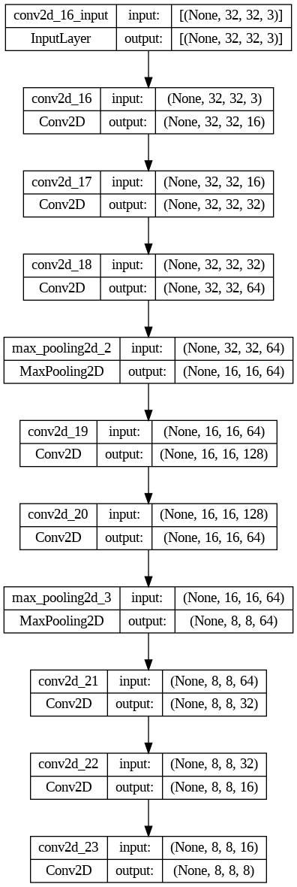
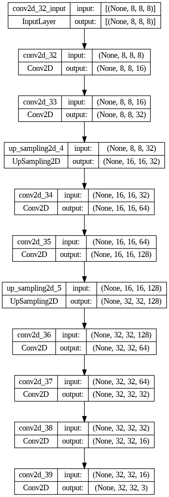
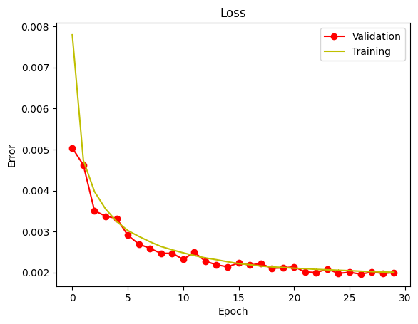

# Image Similarity using a custom Autoencoder
This project contains an Autoencoder, built and trained using Tensorflow, and used to vectorize images, so a kNN algorithm can check for image similarity.

It contains two major Python notebooks, one in which we define the architecture of the model and train it (using a downsampled version of ImageNet), and one in which we used the already trained encoder architecture to vectorize images and pass them through a kNN, creating a mini image search engine based on pixel similarity.

This was meant as a class project, so it is very imperfect, and not to be taken too seriously, but more like an introduction to what Autoencoders are, how they can be trained and used in a scenario other than blind reconstruction of inputs. Knowing what Autoencoders can do will also help you understand a very important piece of the state-of-art Deep Learning solutions: the Transformers.

*(for the portuguese readers: leiam o , terá tudo que está escrito nas seções abaixo, com informações mais técnicas)*

## Architecture
An Autoencoder contains two architectures: the encoding architecture and the decoding one. The training is done by feeding the images to the encoder, where it'll learn the best way to encode the images based on its architecture. There is a middle part between the architecture, called the bottleneck, or latent representation, containing the enconded example, which will be fed to the decoder, so it can learn to reconstruct the images, learning which characteristic of the input images it should keep.

We are majorly interested in the encoder, since we aim to encode images in a donwsampled vectorized form to easily detect its similarity. Here are both architectures, encoder and decoder, respectively:

Notice how the encoder is made up of successive convolution layers followed by occasional max pooling layers, which donwsample the input. This forces the model to downsample the image to the desired vector shape (in our case, 8x8x8), while learning which are the best characteristics to encode, resulting in a meaningful vectorization.

Dually, the decoder is made up of successive convolution layers, but instead of max pooling, we have upsampling layers, forcing the model to learn which properties of the image to reconstruct.

## Results
You can see the results in the . The subfolder  shows the full aplication of the autoencoder, deconding and reconstructing the image. The subfolder  shows the results of the encoder architecture, paired up with the kNN for similarity search. And, of course, the MSE loss of the training:

